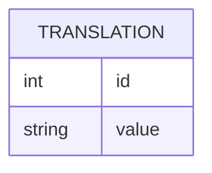

# Laravel Pages

## Installing

-   Install package in your Laravel project

```bash
composer require mguinea/laravel-pages
```

-   Publishing to project

```bash
php artisan vendor:publish --provider="Mguinea\Pages\PagesServiceProvider"
```

## Architecture

### Database schema


