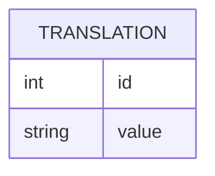

# Laravel Pages

## Installing

-   Install package in your Laravel project

```bash
composer require mguinea/laravel-pages
```

-   Publishing to project

```bash
php artisan vendor:publish --provider="Mguinea\Pages\PagesServiceProvider"
```

## Architecture

### Database schema



## TODO
- [ ] Load routes
- [ ] Backoffice based on breeze (cruds: pages, globals, taxonomies, menus (group taxonimized))
- [ ] Translations (json attributes + db), helpers
- [ ] Taxonomizable
- [ ] Grouppable
- [ ] Spatie media + media not linked to a model (?)
- [ ] Backup from backoffice
- [ ] Generate sitemap, dynamic? -> route sitemap.xml, that generates automatically. Using cache
- [ ] Commonmark with blade placeholder (Extension)
- [ ] Contact form endpoint post + mailable
- [ ] Tests
