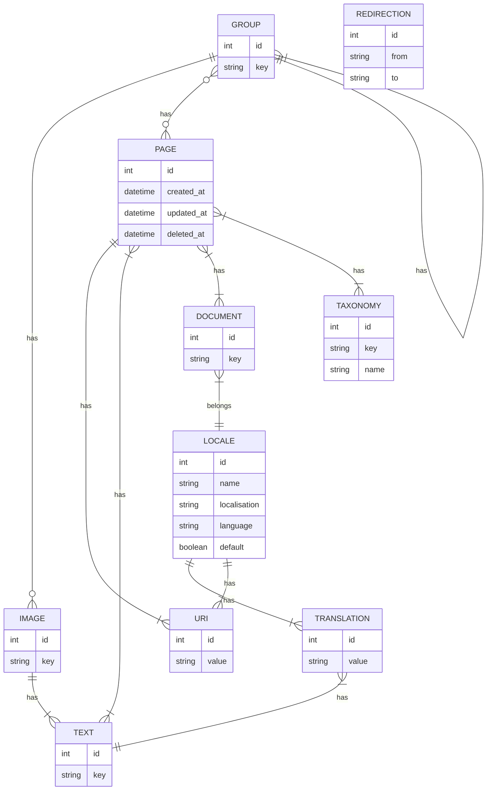

# Laravel Pages

## Installing

- Install package in your Laravel project

```bash
composer require mguinea/laravel-pages
```

- Publishing to project

```bash
php artisan vendor:publish --provider="Mguinea\LaravelPages\PagesServiceProvider"
```

- Add dynamic route handler to your project

```php
Route::get('/{uri?}', function ($uri) {
    var_dump($uri);
})->where('uri', '.*');
```

## Architecture

### Database schema



Document is a markdown content
